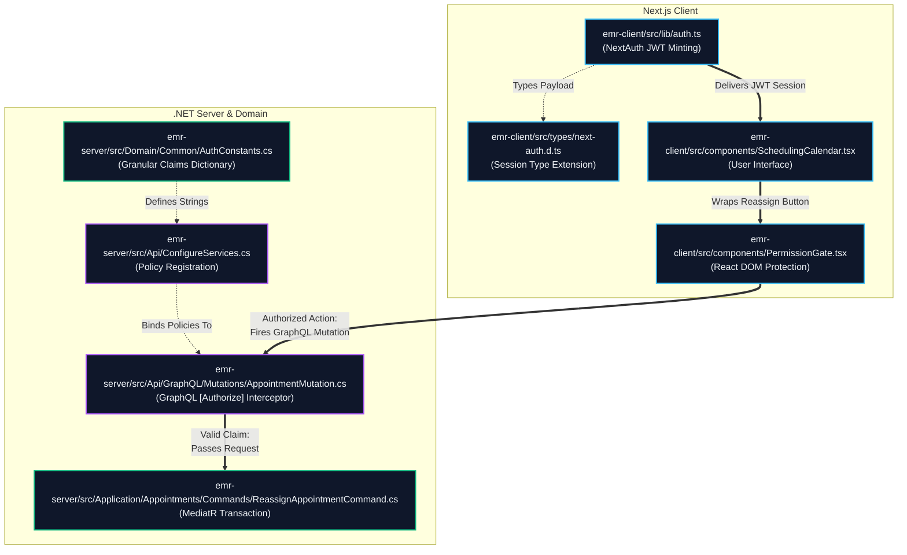

```mermaid
graph TD
    %% Client Side
    subgraph Frontend [Next.js Client]
        Auth["emr-client/src/lib/auth.ts<br>(NextAuth JWT Minting)"]
        Types["emr-client/src/types/next-auth.d.ts<br>(Session Type Extension)"]
        UI["emr-client/src/components/SchedulingCalendar.tsx<br>(User Interface)"]
        Gate["emr-client/src/components/PermissionGate.tsx<br>(React DOM Protection)"]

        Auth -. Types Payload .-> Types
        Auth ==>|Delivers JWT Session| UI
        UI ==>|Wraps Reassign Button| Gate
    end

    %% Backend Side
    subgraph Backend [.NET Server & Domain]
        Constants["emr-server/src/Domain/Common/AuthConstants.cs<br>(Granular Claims Dictionary)"]
        Config["emr-server/src/Api/ConfigureServices.cs<br>(Policy Registration)"]
        Resolver["emr-server/src/Api/GraphQL/Mutations/AppointmentMutation.cs<br>(GraphQL [Authorize] Interceptor)"]
        CQRS["emr-server/src/Application/Appointments/Commands/ReassignAppointmentCommand.cs<br>(MediatR Transaction)"]

        Constants -. Defines Strings .-> Config
        Config -. Binds Policies To .-> Resolver
    end

    %% The Bridge
    Gate ==>|Authorized Action:<br>Fires GraphQL Mutation| Resolver
    Resolver ==>|Valid Claim:<br>Passes Request| CQRS

    %% Styling
    classDef frontend fill:#0f172a,stroke:#38bdf8,stroke-width:2px,color:#f1f5f9;
    classDef backend fill:#0f172a,stroke:#a855f7,stroke-width:2px,color:#f1f5f9;
    classDef domain fill:#0f172a,stroke:#10b981,stroke-width:2px,color:#f1f5f9;

    class Auth,Types,UI,Gate frontend;
    class Config,Resolver backend;
    class Constants,CQRS domain;

```
