# Halkyone Clinical OS

**[🚀 View Live Demo](https://emr-three-hazel.vercel.app)**

### 🔑 Test Credentials

- **User:** `admin@palliative.emr`
- **Password:** `P@ssword123!`

> The first time you log in or access the dashboard, the initial load may be slow (up to 50 seconds). This is due to the **Render Free Instance** spin-up time for the backend services. Once warmed up, the platform maintains sub-second operational performance.

[](https://blog.cleancoder.com/uncle-bob/2012/08/13/the-clean-architecture.html)
[](https://github.com/jbogard/MediatR)
[](https://nextjs.org/)
[](https://dotnet.microsoft.com/)
[](https://www.postgresql.org/)
[](https://github.com/Azure/Azurite)

[](https://next-auth.js.org/)
[](#)
[](https://learn.microsoft.com/en-us/azure/azure-sql/database/saas-tenancy-app-design-patterns)
[](https://dotnet.microsoft.com/apps/aspnet/signalr)
[](https://chillicream.com/docs/hotchocolate)

[](https://surveyjs.io/)
[](https://www.questpdf.com/)
[](https://playwright.dev/)
[](https://github.com/ewceniza9009/emr/actions/workflows/cicd.yml)

[](https://github.com/ewceniza9009/emr/actions/workflows/cicd.yml)
[](https://ionicframework.com/)
[](https://capacitorjs.com/)
[](https://firebase.google.com/docs/cloud-messaging)

---

## 📊 Clinical QA & Reliability Report

[**📊 View Full CI/CD History**](https://github.com/ewceniza9009/emr/actions/workflows/cicd.yml) | [**🏆 Download Playwright Test Artifacts**](https://github.com/ewceniza9009/emr/actions/runs/26083206434/artifacts/7077657883)

> [!IMPORTANT]
> The link above represents a **100% successful verification** of all clinical modules: Enrollment, Scheduling, Booking, and Real-time Telemetry.

---

## 📸 System Screenshot Gallery (20 High-Fidelity Views)

Below is a gallery of screenshots from our clinical web application, admin portal, and patient mobile app, demonstrating the state-of-the-art visual aesthetics and features:

### 💻 Clinical Web & Admin Portals

| View                             | Module / Description                                                                                                | Screenshot                                                                |
| :------------------------------- | :------------------------------------------------------------------------------------------------------------------ | :------------------------------------------------------------------------ |
| **Clinical Dashboard**           | Operational statistics, live vital status notifications, and scheduling overview.                                   |                      |
| **Patient Registry**             | Full clinical active roster search and comprehensive patient grid.                                                  |                         |
| **Clinical Profile**             | Longitudinal patient chart showing charts, demographics, and clinical notes.                                        |                   |
| **Visit Schedule Registry**      | Patient encounter calendar registry with interactive descending/ascending sorting by date.                          | 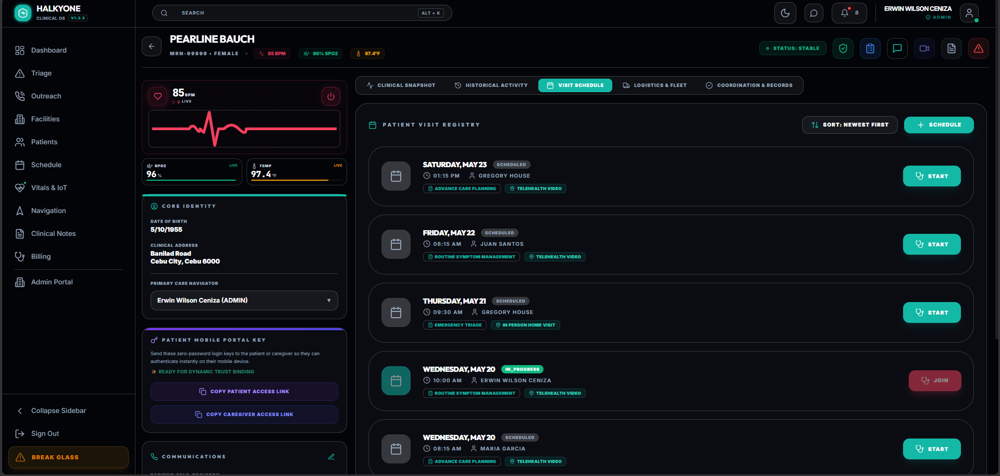  |
| **Clinical Assessment (ESAS-R)** | Edmonton Symptom Assessment System interactive sliders showing multi-item patient symptom severity tracking.        | 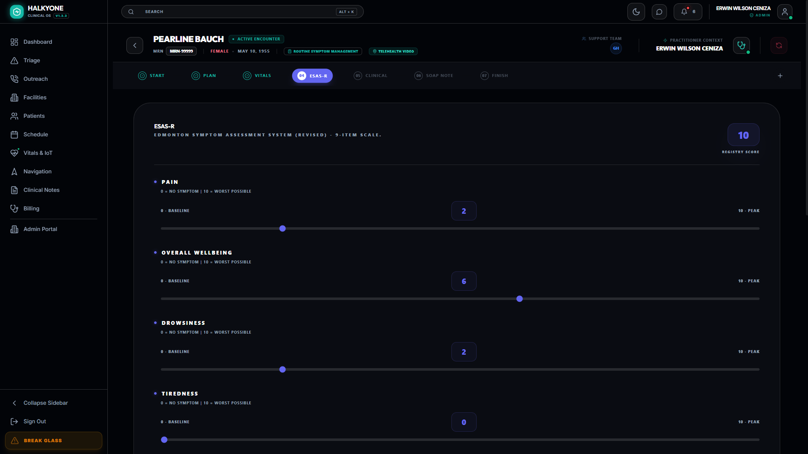    |
| **Visit Summary Drawer**         | Patient encounter vital signs registry, symptom burden analysis, and clinical assessments overlay.                  | 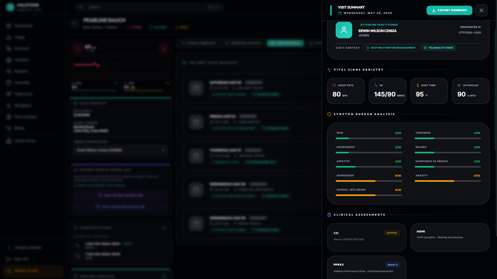 |
| **Outreach Workspace**           | Referral pipelines, follow-up calls, and conversion metrics.                                                        |                       |
| **Enrollment Drawer**            | Quick-enrollment slide-over layout with automatic clinical checklist.                                               |               |
| **Master Schedule**              | Calendar-driven clinical encounter booking and coordinators grid.                                                   |                          |
| **Care Navigation Map**          | Live interactive geospatial navigator locations, facility pins, satellite view overlay, and activity routing paths. | 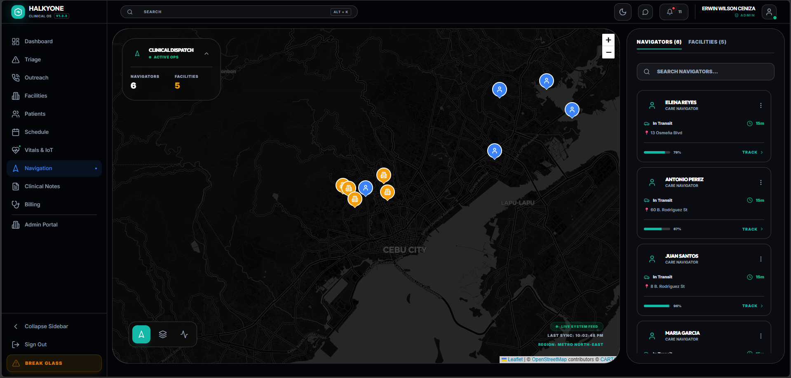                   |
| **Clinical Notes Manager**       | SOAP note workstation with Smart Phrase shortcuts and QuestPDF encounter summary generator.                         | 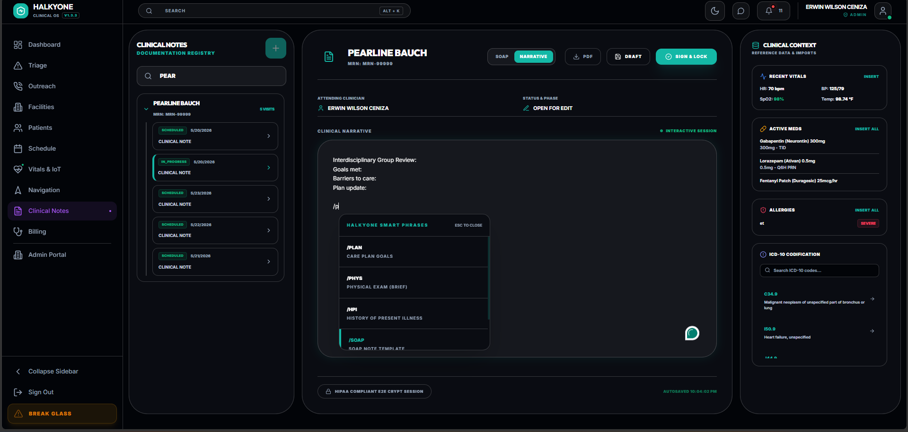                     |
| **Billing Command Center**       | Revenue cycle dashboard, Z-Benefit claim tracking, and co-pay invoice generation interface.                         | 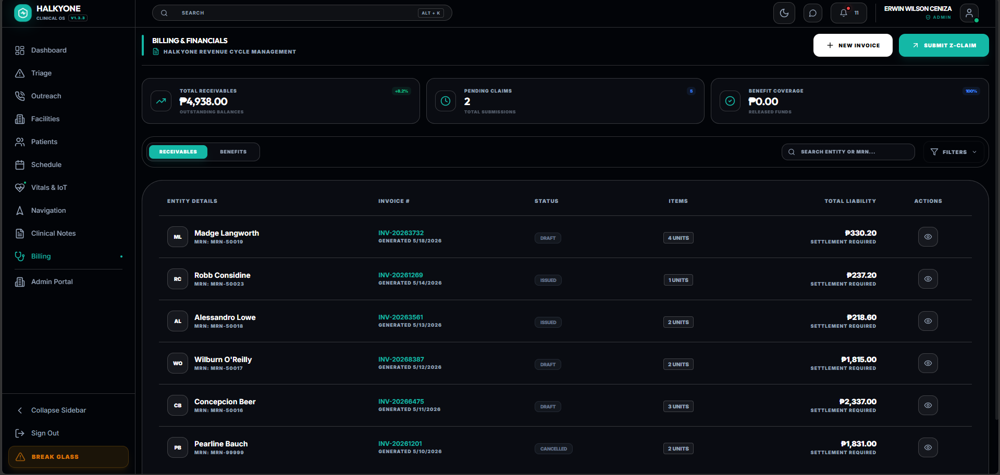                   |
| **Telemetry Vitals Hub**         | Live WebSocket-driven vital streams and real-time simulator grid.                                                   |                    |
| **Admin Security Station**       | Security governance, isolation settings, and tenant controls.                                                       |                           |
| **Resource Heatmap**             | Real-time capacity utilization, caseload distribution heatmap, and clinician grid.                                  |                      |
| **Workload Drill-down**          | Interactive workflow telemetry drawer with compact dispatch adjustment triggers.                                    | 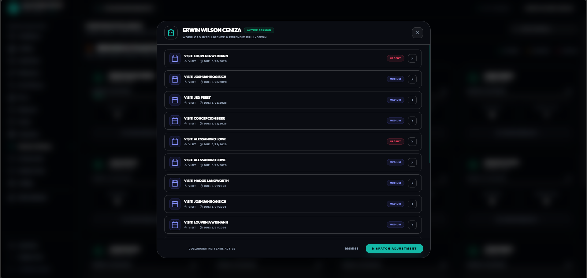            |

### 📱 Patient Mobile App ("Virtual Hospital Room")

| View                      | Module / Description                                                    | Screenshot                                                |
| :------------------------ | :---------------------------------------------------------------------- | :-------------------------------------------------------- |
| **Mobile Login Gate**     | Secure token string link authentication.                                | 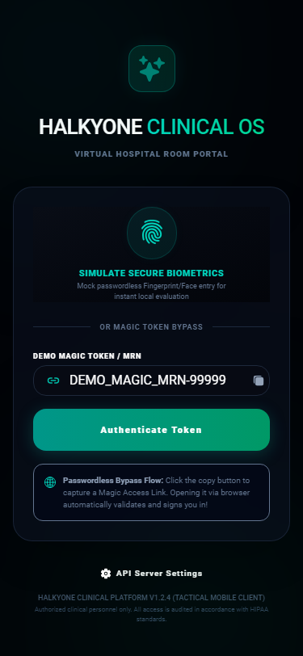        |
| **Comfort Hub Dashboard** | Daily recovery ring, SOS alerts, and vital sign thresholds tracker.     | 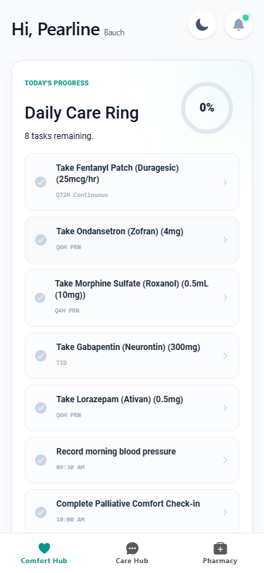       |
| **Secure Care Hub**       | Real-time chat with Care Navigator and telehealth virtual waiting room. | 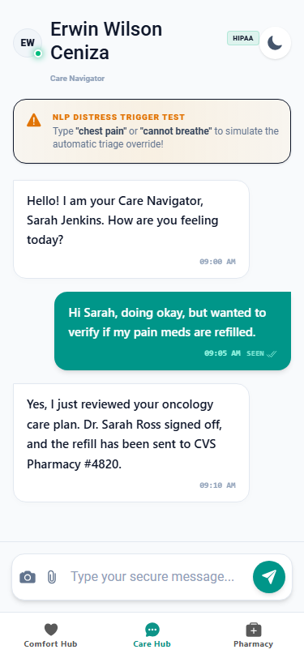  |
| **Pharmacy & eRx**        | Active prescriptions visual pill index and smart local reminders.       | 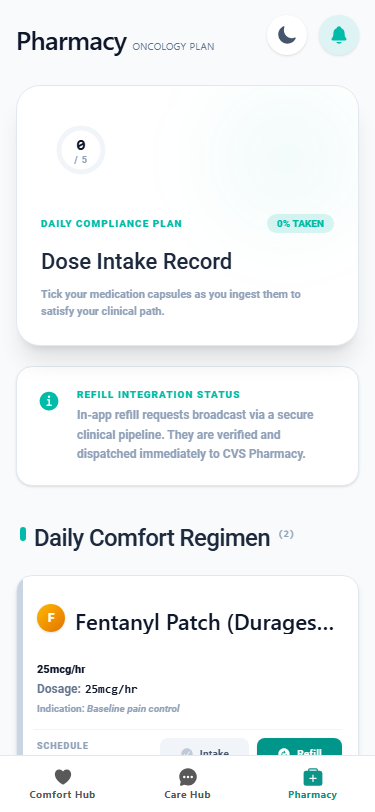 |

---

### The Bounded Contexts

The application is logically partitioned into distinct domains:

- **Clinical:** Patient health records, triage, SOAP notes, vitals, diagnoses, allergies, and prescriptions.
- **Assessments:** Dynamic survey engine and standardized scoring instruments (ESAS/PHQ9/PPS).
- **Billing:** Revenue cycle management, invoice generation, and ZBenefit claim tracking.
- **Logistics & Scheduling:** Multi-stage booking, geospatial clinician dispatch, equipment tracking, and care coordination.
- **Outreach:** Lead management, patient enrollment, and contact logs.
- **Telemetry & IoT:** Real-time vital sign streaming, live patient heartbeats, and device connectivity.
- **Mobile Portal & Patient Experience:** Telehealth video consults, Active Medication lists/pill reminders, Google Pay/Apple Pay billing, Insurance card scanning OCR, Google Fit/Apple HealthKit telemetry, and "Visit Radar" real-time transit tracking.
- **Secure Messaging Hub:** Real-time patient-practitioner threads with push notification support and emergency NLP overrides.
- **Infrastructure & Security:** Multi-tenant isolation, forensic audit trails, and system-wide security governance.

---

## 🏗️ System Architecture Diagram

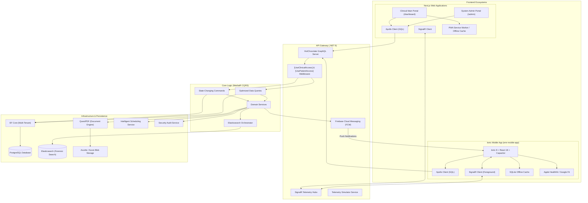

---

## 🏛️ System Divisions: The Triple-Portal Architecture

Halkyone is split into three specialized frontend ecosystems, each optimized for specific operational roles:

### 1. Clinical Main Portal (`/dashboard`)

Designed for **Clinical Execution**, this portal is the primary workstation for Practitioners, Nurses, and Care Navigators.

- **Guided Visit Workstation:** Streamlined encounter documentation and registry.
- **Clinical HUDs:** Real-time patient telemetry (`LiveHeartbeat`) and vital sign monitoring.
- **Enrollment Wizard:** High-density patient onboarding and demographic management.
- **Scheduling & Logistics:** Multi-stage booking and regional deployment views.
- **Identity HUD:** High-density demographic visualization with real-time data synchronization.
- **Unified Messaging Inbox:** Direct patient triage and messaging panel integrated with active clinical context/vitals.

### 2. System Admin Portal (`/admin`)

The **Operational Nerve Center** for System Administrators and Medical Directors.

- **Infrastructure Oversight:** Multi-tenant configuration and tenant health monitoring.
- **Master Registry Management:** Centralized control over Facilities, Health Plans, and Medications.
- **Security & Audit Vault:** Real-time visibility into system-wide `SecurityAuditLogs` and "Break-Glass" emergency access tracking.
- **Workforce Governance:** Global management of practitioner licensures, service areas, and shift rotations.

### 3. Patient Mobile Portal (`emr-mobile-app` / "Virtual Hospital Room")

A native iOS/Android patient engagement application built using Ionic Framework, React, and Capacitor, allowing patients direct access to their care pathway.

- **Telehealth & Virtual Care Hub:** WebRTC 1-on-1 video consultations and SignalR-driven virtual waiting room.
- **Medication & Pharmacy (eRx):** Live active prescriptions, pill reminders, and one-tap refills routing to Care Navigators.
- **Revenue Cycle Management (RCM):** Apple/Google Pay co-pay settlement, camera OCR insurance card scanner, and PhilHealth Z-Benefit tracker.
- **IoT & Wearables Sync:** Passive step/resting heart rate sync via Apple HealthKit and Google Fit.
- **Secure Messaging & SOS:** Photo uploads (wound triage) bypass the camera roll, with emergency NLP warning systems.
- **Visit Radar Logistics:** Leaflet-based live mapping tracking the clinician's transit vector, with privacy masking at 500m.

---

## 🏗️ Engineering & Architecture

### 1. Clean Architecture & CQRS

The backend follows a strict **Clean Architecture** pattern, ensuring the Domain remains independent of external frameworks.

- **Domain Layer:** Pure clinical entities (`Patient`, `Encounter`, `SmartPhrase`, `Questionnaire`) and enums.
- **Application Layer (CQRS):** Implementation of MediatR for **Command Query Responsibility Segregation**, separating state-changing commands from data-retrieval queries.
- **Infrastructure Layer:** Concrete implementation of Persistence, PDF Generation, and Core Services.
- **Api Layer:** Delivery head for GraphQL (HotChocolate), SignalR Hubs, and Background Workers.

### 2. GraphQL Performance & DataLoaders

Halkyone utilizes a high-performance **Batch-Loading Architecture** via HotChocolate DataLoaders to eliminate the N+1 query problem.

- **Batched Resolvers**: Complex clinical relationships (Prescriptions, Allergies, Diagnoses, Documents) are resolved in optimized batches.
- **Request-Scoped Caching**: Data is cached globally for the duration of a single GraphQL request, preventing redundant database round-trips for shared entities like Practitioners.
- **Sub-Second Hydration**: Even high-density clinical summaries load with minimal SQL overhead, ensuring sub-second Time-to-Interactive (TTI).

### 3. Transactional Outbox & Eventual Consistency

To guarantee 100% reliability between the core Clinical DB and the Elasticsearch search index, Halkyone implements the **Transactional Outbox Pattern**:

- **Atomic Capture**: Domain events (e.g., `PatientCreated`, `LeadEnrolled`) are captured and stored in a SQL-based outbox within the same database transaction as the clinical data.
- **Reliable Background Draining**: A resilient background worker (`ProcessOutboxMessagesJob`) polls and processes the outbox, ensuring that side-effects like search indexing and external API syncs succeed even if services are temporarily unavailable.
- **Guaranteed Consistency**: This architecture ensures that the "Global Search" and "Clinical Registry" never fall out of sync, providing practitioners with a mathematically verifiable "Single Source of Truth."

### 4. Multi-Tenancy & Security

Halkyone implements a **Shared Database / Row-Level Isolation** model:

- **Unified Schema**: All tenants (hospitals/clinics) share a single database, maximizing cost-efficiency and simplifying migrations.
- **Row-Level Security**: Every clinical entity is anchored to a `TenantId`. Data isolation is enforced at the repository level via EF Core Global Query Filters, ensuring a practitioner from Tenant A can never view data from Tenant B.
- **`[UseClinicalAccess]` & `[UsePatientAccess]` Attributes**: Centralized GQL middleware for identity resolution and deep-inspection security, resolving both clinical staff and patient mobile sessions.
- **Break-Glass Protocol**: Audited emergency access override for high-authority record viewing.

> [!NOTE]
> This follows the **"Multi-tenant app with a shared database"** pattern as defined in the [Microsoft SaaS Tenancy Guide](https://learn.microsoft.com/en-us/azure/azure-sql/database/saas-tenancy-app-design-patterns).

### 5. Mobile Native Integration & Push Infrastructure

The patient mobile client leverages Capacitor for physical hardware access while maintaining clean server interaction:

- **Token String Link Authentication**: Secured login utilizing single-use token links to authorize patient sessions.
- **Hybrid Real-Time Delivery**: Combines foreground WebSocket SignalR connections with background Firebase Cloud Messaging (FCM) notifications to wake the device when inactive (e.g., clinician `InTransit`).
- **Offline Tolerance**: Local SQLite caching of SurveyJS assessments, allowing patients to complete intake reports and ESAS forms offline and sync when connection is restored.

---

## ⚙️ Setup & Configuration

The **Setup Command Center** (`SetupDrawer.tsx`) provides practitioners and administrators with high-authority control over the clinical environment.

### 1. Assessment SurveyJS Setup

Practitioners can architect and deploy custom clinical instruments:

- **Survey Creator Widget:** Drag-and-drop designer (`SurveyCreatorWidget.tsx`) for building custom clinical forms.
- **Instrument Tagging:** Surveys are categorized by `AssessmentType` (e.g., ESAS, PHQ-9, PPS, MSAS).
- **Versioned Schemas:** Schema JSON is stored in the `Questionnaires` registry for instant deployment.

### 2. Workforce Management & Governance

- **Practitioner Registry:** Management of clinical staff, roles, and NPI numbers.
- **Licensure Tracking:** Multi-state licensure management with expiry monitoring.
- **Service Deployment Zones:** Coordinate-aware assignment of practitioners to ZIP codes and sectors.
- **Base Operations:** Home-base address tracking for geospatial routing and travel estimation.

---

## 🩺 Clinical Workstation Modules

### 1. Dynamic Assessment Infrastructure

- **Dynamic Rendering:** On-the-fly rendering via `DynamicAssessment.tsx` with conditional logic.
- **Atomic Hydration:** Precision-loading of complex JSON schemas with sub-second latency.
- **Response Persistence:** Encrypted `AnswersJson` storage for trend analysis.

### 2. Standardized Scoring & Instrument Engine

- **ESAS-R:** Real-time tracking of 9 core symptoms (Pain, Nausea, etc.).
- **PPS (Palliative Performance Scale):** Rapid functional status assessment.
- **PHQ-9 & FICA:** Standardized depression and spiritual assessments.
- **Vital Sign Timeline:** Real-time logging and trend visualization for HR, BP, SpO2, and Temp.

### 3. Documentation Accelerators

- **Smart Phrase Engine:** Shortcut-driven templates (`/soap`, `/death`, `/meds`) to eliminate charting friction.
- **Outreach Call Scripts:** Standardized protocols for Enrollment, Bereavement, and Assessment coordination.

### 4. Mobile Patient Workstation & "My Recovery"

- **The Daily Care Ring:** Interactive progress visualization indicating medication and survey compliance.
- **Native-Styled SurveyJS:** Custom wrapper using Ionic components (`IonContent`) for seamless rendering of ESAS-R and PHQ-9 forms.
- **Secure Token Link Auth:** Protecting patient sessions locally through secure token-based authentication links.

---

## 🗺️ Geospatial Logistics & Scheduling

### 1. Intelligent Scheduling Service

The `SchedulingService.cs` manages clinical deployment complexity:

- **Slot Resolution:** Timezone-resilient logic for available window identification.
- **Geospatial Assignment:** Automatic practitioner suggestions based on regional sectors.
- **Capacity Management:** Enforces operational duration constraints (15-60 mins).

### 2. Geospatial Intelligence

- **Regional Clustering:** Grouping of patients/practitioners into sectors (e.g., Cebu City, Mandaue).
- **Travel Time Estimation:** Precision-clamped (15-45 mins) drive-time calculations utilizing the Haversine formula.
- **Sonar Signals:** Real-time SignalR tracking of clinician "vectors" across the map.
- **Visit Radar Integration:** Real-time Leaflet map showing the clinician approaching the patient's home via SignalR coordinates, masking at 500 meters for security.

---

## 💰 Revenue Cycle & Infrastructure Services

### 1. RCM & Billing Integration

- **Z-Benefit Claim Engine:** Integrated support for Philhealth Z-Benefit claims and status tracking.
- **Invoice Command Center:** Professional invoice generation and financial reconciliation.
- **Mobile Native Payments:** Apple Pay and Google Pay integration for instant co-pay settlements on the patient mobile app.
- **OCR Insurance Scanner:** Native camera-based OCR scanning to automatically extract policy numbers and link to care records.

### 2. Core Operational Services

- **QuestPDF Service:** High-fidelity clinical note and summary generation.
- **Telemetry Simulator:** Background worker synthesizing live vitals (HR, BP, SpO2).
- **Azurite Storage:** Secure clinical document vault for Advance Directives and POC summaries.
- **Security Audit Service:** Forensic trail of every data access event across the system.
- **Elasticsearch Integration:** High-performance, full-text search engine for global patient discovery and forensic audit analysis.

---

## 🎨 Theme System & UI Hardening

- **Administrative Parity:** Extended full theme-aware support to the entire /admin ecosystem. Residual "Black Artifacts" in components like SecurityAuditVault, IdentityManagement, and IntegrationsSync have been eliminated, ensuring 100% legibility in high-density light-mode environments.
- **Forensic Legibility:** Standardized all forensic table headers and status tags with clinical theme variables. High-authority administrative data now retains its professional "Clinical Command" aesthetic while adapting seamlessly to workstation lighting conditions.
- **Dynamic Designer Synchronization:** Refactored the SurveyCreatorWidget and FormDesignerPage to ensure that the SurveyJS authoring environment respects the global theme context, providing a consistent and strain-free experience for clinical instrument architects.
- **Global UI Variable Consolidation:** Finalized the codebase-wide transition from hardcoded white-alpha and slate-950 values to dynamic CSS variables, ensuring future-proof aesthetic consistency across all current and future clinical modules.

---

## ⚡ Reliability & Performance Optimization

The Halkyone Clinical OS has undergone rigorous hardening to transition from a high-fidelity prototype into a production-ready enterprise system.

### 1. Performance & UI Optimization

- **Dynamic Component Architecture:** Heavy dependencies (SurveyJS, Leaflet Maps, and Recharts) are now loaded on-demand using `next/dynamic`. This significantly reduces initial bundle sizes and ensures sub-second Time-to-Interactive (TTI).
- **Premium Loading States:** Integrated a standardized Skeleton design system. High-fidelity placeholders replace generic spinners, maintaining the platform's luxury aesthetic during data hydration.
- **Resource Segmentation:** Refactored the Patient Profile and Schedule pages to utilize lazy-loading patterns, optimizing the most data-heavy modules in the ecosystem.

### 2. Clinical Resilience (PWA)

- **Offline Clinical Capabilities:** Integrated `next-pwa` and Service Worker orchestration. Practitioners can now access cached clinical interfaces in "dead zones" or low-connectivity environments (e.g., rural home health visits).
- **Installable Desktop/Mobile App:** Full PWA compliance with `manifest.json` and optimized metadata, allowing Halkyone to be deployed as a standalone native application.

### 3. Professional E2E Testing Suite

- **Playwright Integration:** Established a robust End-to-End testing framework to automate mission-critical clinical validation.
- **Clinical Smoke Tests:** Automated verification of the "Critical Enrollment Path" and "Dashboard Metrics," ensuring that infrastructure updates do not degrade core clinical workflows.

## 💾 Domain & Schema Extensions (.NET 9 EF Core)

To support the Triple-Portal Architecture and the Patient Mobile Portal, the existing PostgreSQL database schema and `.NET 9 Domain` are extended with the following entities:

### 📱 Mobile Tokens & Secure Chat Schema

```csharp
// Domain/Entities/MobileDeviceToken.cs
public class MobileDeviceToken : BaseEntity, ITenantEntity {
    public Guid DeviceTokenId { get; set; } = Guid.NewGuid();
    public Guid TenantId { get; set; }
    public Guid PatientId { get; set; }
    public string FcmToken { get; set; } = string.Empty;
    public string Platform { get; set; } = string.Empty; // "ios" or "android"
}

// Domain/Entities/CareThread.cs
public class CareThread : BaseEntity, ITenantEntity {
    public Guid CareThreadId { get; set; } = Guid.NewGuid();
    public Guid TenantId { get; set; }
    public Guid PatientId { get; set; }
    public Guid PractitionerId { get; set; } // The Care Navigator
    public ICollection<ChatMessage> Messages { get; set; } = new List<ChatMessage>();
}

// Domain/Entities/ChatMessage.cs
public class ChatMessage : BaseEntity, ITenantEntity {
    public Guid ChatMessageId { get; set; } = Guid.NewGuid();
    public Guid TenantId { get; set; }
    public Guid CareThreadId { get; set; }
    public Guid SenderId { get; set; }
    public string SenderRole { get; set; } = string.Empty; // "Patient" or "Practitioner"
    public string Content { get; set; } = string.Empty;
    public string? AttachmentUrl { get; set; }
    public bool IsRead { get; set; } = false;
}
```

## 📋 Mobile Issue Registry & Sprint Tasks

To track the progress of transitioning the Halkyone Clinical OS into the **Triple-Portal Architecture**, we utilize the following Epic registry:

### Phase 1: Native Mobile Foundation & Auth

- **[#2] Initialize Ionic React workspace (`emr-mobile-app`) with Tailwind CSS** _(COMPLETED)_
- **[#3]** Implement `PatientAccount` & `CaregiverLink` DB entities (Entity Framework Core) _(COMPLETED)_
- **[#4]** Configure `@capacitor/core`, `@capacitor/ios`, and `@capacitor/android` _(COMPLETED)_
- **[#5]** Build token string link authentication workflow _(COMPLETED)_
- **[#6]** Expose `[UsePatientAccess]` GraphQL authorization middleware in `.NET 9` _(COMPLETED)_

### Phase 2: Secure Care-Team Messaging Engine

- **[#7]** Add `CareThread` and `ChatMessage` models to PostgreSQL _(COMPLETED)_
- **[#8]** Implement SignalR `ChatHub` for real-time bi-directional message broadcast _(COMPLETED)_
- **[#9]** Build Unified Messaging Inbox UI for Care Navigators in the Next.js `/dashboard` _(COMPLETED)_
- **[#10]** Add NLP Emergency Override (intercepting "chest pain" texts for alerts) _(COMPLETED)_
- **[#11]** Implement native camera wound-triage photo uploads via Capacitor to Azurite _(COMPLETED)_

### Phase 3: Telehealth & Medication Management

- **[#12]** Integrate native WebRTC for secure 1-on-1 virtual visits with Virtual Waiting Room _(COMPLETED)_
- **[#13]** Render the patient's active prescriptions (eRx) with visual pill identifiers _(COMPLETED)_
- **[#14]** Build Smart Pill Reminders via Capacitor Local Notifications _(COMPLETED)_

### Phase 4: Dynamic Assessments & Logistics (Visit Radar)

- **[#15]** Embed SurveyJS React components into `IonContent` for ESAS-R/PHQ-9 trackers _(CHANGED)_
- **[#16]** Implement local offline draft caching via Capacitor SQLite _(TBD)_
- **[#17]** Build the "Visit Radar" Leaflet map, subscribing to SignalR transit vectors _(TECH DEBT)_
- **[#18]** Configure Firebase Cloud Messaging (FCM) to wake up the app when clinician is `InTransit` _(TECH DEBT FOR NOW)_

### Phase 5: RCM Billing & Wearable Telemetry

- **[#19]** Add Apple Pay / Google Pay integrations for copay settlements _(NOT GOING TO PURSUE FOR NOW)_
- **[#20]** Implement native camera OCR for Insurance Card scanning _(NOT GOING TO PURSUE FOR NOW)_
- **[#21]** Bridge Apple HealthKit / Google Fit for passive steps & resting HR sync _(NOT GOING TO PURSUE FOR NOW)_

## 🛠️ The System Toolchain

### 🛠️ Core Technologies Used

- **Web Portals**: Next.js 14 (App Router), React, Tailwind CSS, Framer Motion
- **Mobile Client**: Ionic Framework v8, React 18, Capacitor (iOS & Android native bridge), SQLite
- **Backend API**: .NET 9, C#, ASP.NET Core Web API (HotChocolate GraphQL, SignalR)
- **Database**: PostgreSQL with Entity Framework Core
- **Search & Forensics**: Elasticsearch for Global Clinical Search and Audit Logs
- **Real-time**: SignalR for Patient Telemetry, Chat Messaging, & Live clinician vectors

### 📦 Key Integrated Packages

- **Backend Infrastructure (.NET 9)**:
  - `HotChocolate`: Enterprise-grade GraphQL Engine with custom access middlewares (`[UseClinicalAccess]`, `[UsePatientAccess]`).
  - `SignalR`: Real-time WebSocket synchronization for **Live Patient Telemetry**, **Chat Messaging**, and system heartbeats.
  - `Azurite`: Local emulation for Azure Blob Storage, ensuring seamless **Clinical Document Persistence** and Chat Media attachments.
  - `MediatR`: CQRS architecture for decoupled, scalable clinical command processing.
  - `QuestPDF`: Declarative PDF engine for generating high-fidelity **Clinical Encounter Summaries**.
  - `Bogus`: Mock data generator for high-entropy clinical seeding in dev/CI environments.
  - `OpenTelemetry`: Distributed tracing and observability for mission-critical monitoring.
- **Frontend Clinical Engine (Next.js 14)**:
  - `SurveyJS`: Professional-grade engine for complex **Clinical Assessments** and Intake workflows.
  - `Apollo Client`: Advanced GraphQL state management with robust caching and synchronization.
  - `Framer Motion`: High-performance animation library for a premium, low-friction clinical UX.
  - `Recharts`: Real-time operational data visualization for clinical decision support.
  - `Leaflet`: Geospatial intelligence for care navigation and practitioner logistics.
  - `SignalR Client`: Edge-side synchronization for real-time heartbeat monitoring.
- **Mobile Client Integration**:
  - `@capacitor/core`, `@capacitor/ios`, `@capacitor/android`: Native wrapper for iOS and Android deployment.
  - `Token Authentication Link`: Secured login utilizing single-use token links.
  - `SQLite (Capacitor plugin)`: Secure local storage for SurveyJS offline assessment drafts.

| Category           | **Technologies / Tools Used**                                                            |
| :----------------- | :--------------------------------------------------------------------------------------- |
| **Backend Core**   | .NET 9, HotChocolate GraphQL, EF Core (PostgreSQL), MediatR, SignalR, Elasticsearch.     |
| **Frontend**       | Next.js 14 (App Router), Apollo Client, Tailwind CSS, SurveyJS, Lucide React, next-pwa.  |
| **Mobile App**     | Ionic v8, React 18, Capacitor, SQLite, Firebase Cloud Messaging (FCM), Google/Apple Pay. |
| **Infrastructure** | Azurite/Azure Blob Storage, QuestPDF, Bogus (Data Seeding), Docker.                      |
| **Testing & QA**   | Playwright E2E, Vitest (Unit), GitHub Actions.                                           |
| **Security**       | JWT Claims, Token Link Auth, [UseClinicalAccess] & [UsePatientAccess] Middleware.        |

---

## ✅ Clinical QA Verification (E2E & Unit)

Halkyone maintains a **100% Reliability Target** via automated mission-critical audits.

### 🛡️ Playwright E2E Verification

The full clinical lifecycle is validated on every push:

- **✓ Patient Enrollment**: Multi-phase workflow (Admin, Legal, Clinical, Logistics) converting leads to MRN-verified patients.
- **✓ Clinical Booking**: Search-integrated appointment scheduling with high-precision temporal slot resolution.
- **✓ Dashboard & Registry**: Verification of clinical HUD metrics and high-density patient table hydration.
- **✓ Master Schedule**: Multi-view calendar rendering, grid navigation, and encounter initialization.
- **✓ Outreach Worklist**: Lead management tracking, search performance, and enrollment drawer triggers.
- **✓ Telemetry Hub**: Verification of the clinical grid scanner and real-time monitoring interface.

### 🧪 Unit & Integration Testing

- **Clinical Logistics**: Precision-clamped travel time, geospatial distancing, and shift boundary validation in `SchedulingService`.
- **Command Integrity**: Atomic verification of `BookAppointment` and `FinalizeEnrollment` state transitions and MRN generation.
- **Infrastructure Stability**: EF Core multi-tenant isolation, migration integrity, and notification service orchestration.
- **Frontend Hygiene**: Next.js App Router navigation, hydration stability, and session context verification.

---

---

## 🧠 Technicalities vs. Functional Matrix

| Category          | **Technicalities (The "How")**                                   | **Functional (The "What")**                                 |
| :---------------- | :--------------------------------------------------------------- | :---------------------------------------------------------- |
| **Multi-Tenancy** | Row-level isolation via Global Query Filters and JWT resolution. | Secure data segregation for hospital networks.              |
| **Security**      | `[UseClinicalAccess]` attribute for deep-inspection validation.  | "Break-Glass" emergency access and role protection.         |
| **Scheduling**    | Timezone-resilient slot logic in `SchedulingService.cs`.         | Operational booking of in-person and telehealth encounters. |
| **Telemetry**     | `TelemetrySimulator` background worker via SignalR blips.        | Real-time monitoring of patient HR, SpO2, and acuity.       |
| **Geospatial**    | Haversine distance calculations and sector clustering.           | Intelligent clinician routing and sector tracking.          |

---

## 📂 Project Structure

```text
.
├── emr-client/          # Next.js Clinical Frontend
│   ├── src/app/admin/   # System Admin Portal Ecosystem
│   ├── src/app/dashboard/ # Clinical Main Portal Ecosystem
│   ├── src/components/  # High-density UI (SurveyJS, Booking, HUDs, Drawers)
│   └── src/lib/         # GQL Fragments & Apollo Infrastructure
├── emr-mobile-app/      # Ionic/Capacitor Patient Mobile App
│   ├── android/         # Android Native Project Config
│   ├── ios/             # iOS Native Project Config
│   ├── src/components/  # Mobile Components (Visit Radar, Daily Care Ring)
│   └── src/pages/       # Mobile Pages (Telehealth, Messaging, Pharmacy, Billing)
├── emr-server/          # .NET 9 Multi-Tenant Backend
│   ├── src/Domain/      # Entities (Patient, Encounter, Telemetry, Mobile Schema)
│   ├── src/Application/ # MediatR Micro-flows (Commands & Queries)
│   ├── src/Infrastructure/ # Concrete Services (Pdf, Scheduling, Storage, FCM, Audit)
│   └── src/Api/         # GraphQL Resolvers, SignalR Hubs, TelemetrySimulator
└── Database/            # SQL Schema & Core Seeding Logic
```

---

## 🏥 A Day in the Life: Halkyone in Action

To truly understand the efficacy, scalability, and industry-level architecture of Halkyone Clinical OS, we must observe it under the extreme pressures of a live clinical environment. This is a look at how Halkyone’s architectural choices solve real-world medical challenges.

### 📍 07:30 AM | The Operational Briefing (Mandaue City Command Center)

David, a Senior Care Navigator for the Visayas Health Network, logs into the Halkyone `/dashboard`. Instantly, the Next.js frontend resolves his JWT session and establishes a secure Apollo Client connection.

Halkyone operates on a strict **Row-Level Isolation** architecture. When David’s dashboard queries the PostgreSQL database via Entity Framework Core, Global Query Filters automatically append his specific `TenantId`. David only sees the thousands of patients belonging to his specific healthcare network. The data of other hospital chains using the system is cryptographically and structurally invisible to him, ensuring absolute zero-trust tenant segregation.

### 🚨 08:15 AM | The Mobile SOS & Geospatial Dispatch

Maria, a 68-year-old hospice patient in Sector 4, experiences a sudden, severe spike in breakthrough pain. She opens the **Halkyone Patient Mobile App** using her secure token authentication link. Rather than calling a busy hotline, she navigates to the **Secure Messaging Hub** and types: _"chest pain and severe breathing difficulty"_.

The backend's NLP processing engine intercepts this message. Recognizing critical distress triggers, it immediately bypasses standard queues to broadcast a high-priority SignalR alert directly to David's Triage HUD. Maria also uses the secure mobile camera to take a photo of her swollen leg, transmitting it as an encrypted upload to the Azurite server (bypassing her personal camera roll for HIPAA compliance).

David sees the SOS override on the `/dashboard`, views Maria's uploaded leg photo, and clicks the **Scheduling & Logistics** module. The .NET 9 `SchedulingService` engine leaps into action, executing geospatial vector calculations using the Haversine formula. It evaluates the Sonar Signals of all field clinicians, clamps the drive-time estimates, and identifies Dr. Elena—a palliative specialist currently just 15 minutes away from Maria's coordinates. With two clicks, David deploys the encounter command.

### 🚗 08:30 AM | Visit Radar & Real-Time Tracking

Maria’s phone vibrates with a **Firebase Cloud Messaging (FCM)** background push notification: _"Dr. Elena is on her way to your location."_ Maria opens the app and navigates to the **Visit Radar** logistics screen. On a Leaflet-rendered map, she watches Dr. Elena's vehicle approach in real-time using SignalR coordinate updates. To protect Dr. Elena’s personal safety and privacy, the system automatically masks her precise location once she is within 500 meters of Maria's home.

### 🩺 09:00 AM | The Zero-Latency Bedside Encounter

Dr. Elena arrives at Maria’s residence. Opening her tablet, she is not burdened by heavy, loading-intensive screens. The **App Router and HotChocolate GraphQL architecture** deliver Maria's clinical history with sub-second latency. Because of highly optimized GraphQL projections, the payload fetches only the exact data required—no over-fetching, no wasted bandwidth.

Elena launches the `DynamicAssessment` module. Instead of loading hardcoded React components, the system rapidly hydrates an ESAS-R (Edmonton Symptom Assessment System) form from a stored **SurveyJS JSON schema**. This allows Elena to fluidly glide through the 9 core symptom sliders. As she inputs data, it persists instantly via isolated MediatR commands, completely decoupling the UI from the intricate backend domain logic.

### 📝 09:30 AM | Automated Synthesis and Storage

After administering a fast-acting analgesic, Elena needs to chart the encounter. She types `/soap` and `/meds`. Halkyone's **Smart Phrase Engine** detects the commands and instantly expands her shortcuts into standardized, highly formatted clinical notes.

She hits "Sign." The backend intercepts the MediatR command and triggers the **QuestPDF engine**. In milliseconds, it silently generates a high-fidelity, legally compliant PDF Visit Summary. This document is immediately encrypted and routed to the **Azurite Document Vault**, securing Maria's Advance Directives and clinical summaries off the main database thread.

### 📉 11:45 PM | The Telemetry Crisis and The Break-Glass Protocol

Maria is resting, but her vital signs are constantly monitored by Halkyone’s **LiveHeartbeat** module. A pulse oximeter on her finger streams data seamlessly through Halkyone’s **SignalR Telemetry Hubs**.

Suddenly, Maria’s SpO2 levels dip dangerously low. The system does not wait for a browser refresh. The asynchronous WebSocket connection pushes a high-priority blip directly to the night-shift dispatcher’s screen at the Regional Telemetry Hub.

The on-call Night Director, Dr. Aris, receives the urgent escalation. However, Dr. Aris is a cross-coverage physician and lacks standard policy access to Maria's specific clinical vault. Time is critical.

Dr. Aris clicks the **"Break-Glass" Emergency Override**. He types his override justification: _"Acute Respiratory Distress - Cross Coverage."_ The custom `[UseClinicalAccess]` deep-inspection middleware catches the request. It validates the emergency parameters and temporarily rewrites his authorization claims, instantly granting him high-authority viewing rights. Simultaneously, the **Security Audit Service** locks down an immutable forensic log of the override event. Dr. Aris saves Maria's life, and the hospital's compliance officers have a mathematically verifiable audit trail for HIPAA adherence.

### 💰 08:00 AM (Next Day) | Revenue Cycle & Mobile Settlement

Dr. Aris successfully guided the night nurse through a medication adjustment. Maria is stabilized and resting comfortably.

Back at the Nerve Center, billing administrators log into the `/admin` portal. The previous day's encounters—Elena's dynamic assessment, the secure messaging triage, and Dr. Aris's emergency intervention—are already waiting in the **Revenue Cycle Management** module. Halkyone has automatically verified the multi-state practitioner licensures and queued the encounter data into the **Z-Benefit Claim Engine** for Philhealth processing.

Simultaneously, Maria's caregiver receives a push notification on their mobile device. They open the **Halkyone Patient Mobile App**, review the pending co-pay invoice, and settle the balance securely with a single tap using Apple Pay. The PhilHealth tracker update appears live on Maria's mobile dashboard showing claim approval progress in real-time.

In exactly 24 hours, Halkyone Clinical OS navigated complex geospatial logistics, handled real-time streaming telemetry, executed dynamic clinical documentation, enforced enterprise-grade security overrides, and prepped financial billing—all while integrating patient mobile interactions seamlessly and securely.

---

## 🛠️ Modernized UI Layouts & Sorting (May 2026 Updates)

We have polished the clinical portal and administrative workstation to increase information density, visual balance, and navigation flow:

### 1. High-Density Resource Heatmap Grid

- **Visual Compaction**: Clinician cards are downsized (`p-5`, outer radius `rounded-[1.5rem]`) and grid gutters tightened to fit more practitioners above the fold on dense coordinator workspaces.
- **Streamlined Telemetry Indicators**: Load bars, status badges, case counters, and review actions are refactored to minimize vertical scroll requirements.
- **Balanced Header Alignment**: Height coordinates for the sidebar logo segment and the main dashboard header are aligned to a uniform `h-14` (56px) across the entire clinical and admin portals, resolving the previous border offsets.

### 2. Workload Intelligence Drill-down Modal

- **Compact Telemetry Rows**: Slashed the workflow list padding, priority badge scales, and icon boundaries, resulting in a condensed and clean forensic audit layout.
- **Interactive Capacity Dispatch**: The _Dispatch Capacity Adjustment_ action prompts coordinate nodes for confirmation before executing automated rebalancing, automatically closing the modal upon completion.

### 3. Chronological Visit Registry Sorting

- **Default Descending Ordering**: Patient appointments are automatically sorted by scheduled start date in descending order (newest encounters first).
- **Interactive Direction Toggle**: Added a "Sort: Newest First" / "Sort: Oldest First" control button next to scheduling controls, featuring an `ArrowUpDown` indicator icon for instant chronological timeline swapping.

---

Developed with ❤️ by **Erwin Wilson Ceniza**

© 2026 Halkyone Clinical Operations. All rights reserved.
