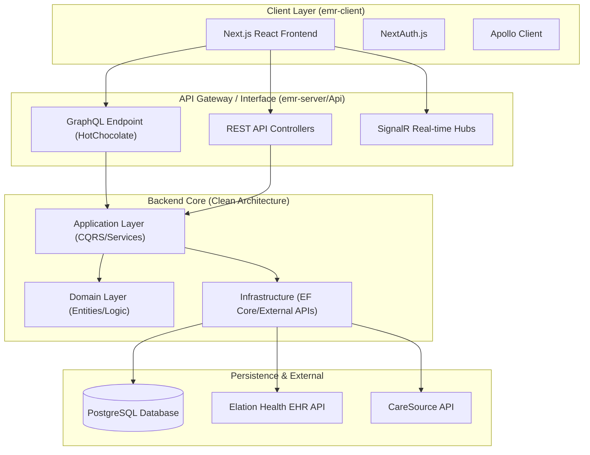

# Aura Clinical OS: Palliative EMR System

[](https://blog.cleancoder.com/uncle-bob/2012/08/13/the-clean-architecture.html)
[](https://nextjs.org/)
[](https://dotnet.microsoft.com/)
[](https://www.postgresql.org/)

## 🏥 Project Overview

**Aura Clinical OS** is a high-performance, real-time Electronic Medical Record (EMR) system specifically engineered for palliative care environments. It bridges the gap between clinical execution and operational logistics, providing care teams with a tactical command center for patient management.

The system is designed to handle high-density clinical data with sub-second latency, featuring real-time telemetry, advanced scheduling algorithms, and seamless integrations with third-party health platforms.

---

## 🏗️ System Architecture

The project follows a modern **distributed architecture** with a clear separation of concerns, utilizing **Clean Architecture** on the backend and a **Server-Side Rendered (SSR)** frontend.

### High-Level Architecture Diagram



### Architectural Principles
- **CQRS (Command Query Responsibility Segregation):** Separates read and write operations to optimize performance and scalability.
- **Domain-Driven Design (DDD):** Core clinical logic is encapsulated within the Domain layer, independent of external frameworks.
- **Real-time Synchronization:** Uses SignalR for live provider tracking, sonar blips, and instant status updates across clinical workstations.
- **Type Safety:** Full TypeScript implementation on the frontend and C# on the backend ensures end-to-end type safety.

---

## 🛠️ Technology Stack

### Frontend (`emr-client`)
- **Framework:** Next.js 14 (App Router)
- **Language:** TypeScript
- **Styling:** Tailwind CSS (Modern "Elegant Teal" Clinical Theme)
- **State Management:** Apollo Client (GraphQL) & React Context
- **Authentication:** NextAuth.js

### Backend (`emr-server`)
- **Runtime:** .NET 8 Core
- **API Style:** GraphQL (HotChocolate) & REST
- **Persistence:** Entity Framework Core with PostgreSQL
- **Real-time:** ASP.NET Core SignalR
- **Architecture:** Clean Architecture (Domain, Application, Infrastructure, Api)

---

## 📂 Project Structure

```text
.
├── emr-client/          # Next.js Frontend Application
│   ├── src/app/         # App Router pages and layouts
│   ├── src/components/  # Shared UI components
│   └── src/lib/         # Client-side libraries and utilities
├── emr-server/          # .NET Core Backend Solution
│   ├── src/Domain/      # Enterprise logic and entities
│   ├── src/Application/ # Use cases and interfaces
│   ├── src/Infrastructure/ # Database and external integrations
│   └── src/Api/         # Controllers, GraphQL, and Hubs
└── Database/            # SQL Migration and Schema scripts
```

---

## 🚀 Key Features

- **Tactical Care Navigation:** A high-performance dashboard for real-time provider sector tracking and sonar-based logistics.
- **Guided Visit Registry:** Streamlined clinical workflow for bedside assessments, prioritizing immediate encounter execution.
- **Advanced Scheduling:** Intelligent booking drawer with timezone-resilient slot management and practitioner auto-defaulting.
- **Telemetry Simulation:** Built-in telemetry service for simulating real-time patient vitals and monitoring signals.
- **Third-Party Integration:** Deep integration with Elation Health for EHR synchronization and CareSource for insurance verification.

---

## 💼 Business Specifications

### Core Mission
Aura Clinical OS is designed to transform palliative care from a reactive administrative process into a proactive tactical operation. The system focuses on **Clinical Execution**—ensuring the right clinician is with the right patient at the right time, with all necessary data available instantly.

### Key Operational Workflows
1. **The Enrollment Vector:** Converting outreach leads into active clinical records through an intelligent, multi-stage enrollment wizard.
2. **Tactical Care Navigation:** Real-time visibility into clinician locations and patient needs, utilizing "Sonar" signals for logistics.
3. **The Guided Visit:** A streamlined clinical workstation that prioritizes the bedside encounter, reducing documentation friction.
4. **Interoperability:** Bidirectional data flow with Elation Health (EHR) and CareSource (Payor) to maintain a single source of truth.

### User Roles & Access
- **Care Navigator:** Manages logistics, sector boundaries, and high-level scheduling.
- **Practitioner:** Focuses on patient encounters, clinical documentation, and real-time alerts.
- **Administrator:** Handles system configuration, audit logs, and enterprise-level reporting.

---

## 🗺️ Project Milestones

### ✅ Phase 1: Foundation & Identity (Completed)
- [x] Initialized **Clean Architecture** backend with .NET 8.
- [x] Established **Elegant Teal** modern clinical design system.
- [x] Implemented real-time communication via SignalR for clinical hubs.
- [x] Secured API with JWT and NextAuth integration.

### 🔄 Phase 2: Clinical Discovery (In Progress)
- [x] **Patient Enrollment:** Completed the multi-step enrollment wizard.
- [x] **Scheduling Engine:** Stabilized timezone-resilient booking and practitioner auto-assignment.
- [x] **Visit Registry:** Integrated "Guided Visit" access for immediate clinical execution.
- [ ] **Tactical Navigation:** (Current Focus) Implementing live provider sector tracking and sonar signal visualization.

### 🚀 Phase 3: Enterprise Integration (Upcoming)
- [ ] **Full EHR Sync:** Deep bidirectional synchronization with Elation Health.
- [ ] **Clinical Analytics:** Dashboard for tracking patient outcomes and operational efficiency.
- [ ] **Offline Mode:** Mobile support for bedside assessments in low-connectivity environments.
- [ ] **Telemetry V2:** Integration with real-time wearable patient monitoring devices.

---

## 🛠️ Getting Started

### Prerequisites
- Node.js 18+ & npm
- .NET 8 SDK
- PostgreSQL 15+

### Backend Setup
1. Navigate to `emr-server/src/Api`.
2. Configure `appsettings.json` with your PostgreSQL connection string.
3. Run migrations: `dotnet ef database update`.
4. Start the server: `dotnet run`.

### Frontend Setup
1. Navigate to `emr-client`.
2. Install dependencies: `npm install`.
3. Configure `.env.local` (refer to `CREDENTIALS.md` for local dev keys).
4. Start development server: `npm run dev`.

---

## 🛡️ Production & Security
- **Authentication:** JWT-based stateless authentication integrated with NextAuth.
- **Data Integrity:** Strict PostgreSQL constraints and EF Core transactions.
- **Observability:** Integrated telemetry and logging for clinical audit trails.
- **Scalability:** Stateless API design allowing for horizontal scaling of the backend services.

---

Developed with ❤️ by **Erwin Wilson Ceniza**

© 2026 Aura Clinical Operations. All rights reserved.
