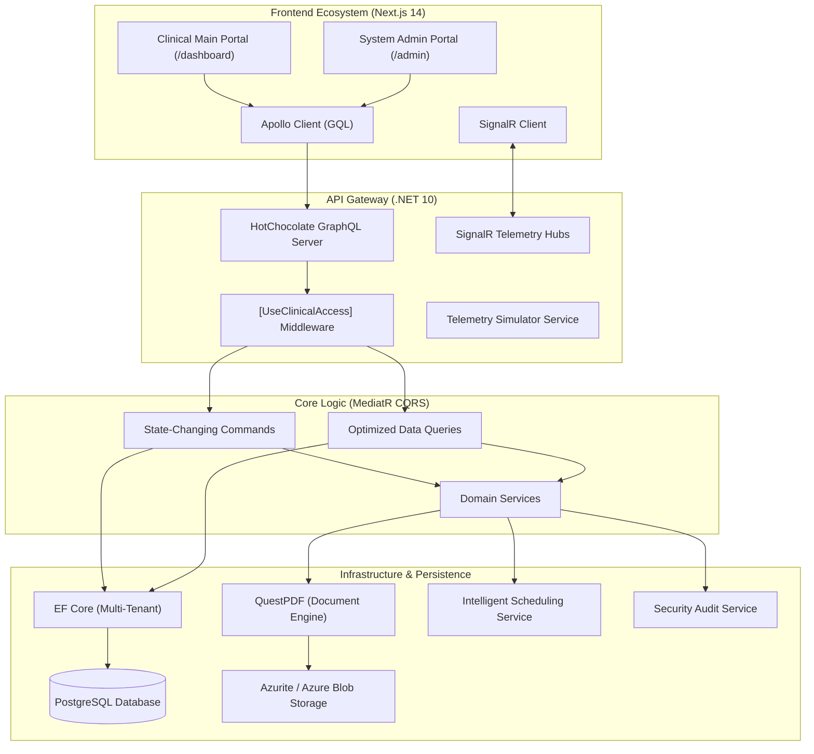

# Halcyon Clinical OS

[](https://blog.cleancoder.com/uncle-bob/2012/08/13/the-clean-architecture.html)
[](https://nextjs.org/)
[](https://dotnet.microsoft.com/)
[](https://www.postgresql.org/)
[]()

## 🏥 Strategic Vision & Mission

**Halcyon Clinical OS** is an enterprise-grade, high-fidelity Electronic Medical Record (EMR) system architected for the mission-critical demands of palliative, hospice, and complex care. It transcends traditional data entry by providing a **Tactical Command Center** that synchronizes clinical documentation, geospatial logistics, and real-time patient telemetry into a unified workstation.

Built for **Clinical Authority**, Halcyon empowers practitioners to execute at the bedside with sub-second latency, declarative security, and automated documentation paths.

---

## 🏗️ System Architecture Diagram



---

## 🏛️ System Divisions: The Dual-Portal Architecture

Halcyon is split into two specialized frontend ecosystems, each optimized for specific operational roles:

### 1. Clinical Main Portal (`/dashboard`)
Designed for **Clinical Execution**, this portal is the primary workstation for Practitioners, Nurses, and Care Navigators.
- **Guided Visit Workstation:** Streamlined encounter documentation and registry.
- **Clinical HUDs:** Real-time patient telemetry (`LiveHeartbeat`) and vital sign monitoring.
- **Enrollment Wizard:** High-density patient onboarding and demographic management.
- **Tactical Scheduling:** Multi-stage booking and regional deployment views.
- **Identity HUD:** High-density demographic visualization with real-time data synchronization.

### 2. System Admin Portal (`/admin`)
The **Operational Nerve Center** for System Administrators and Medical Directors.
- **Infrastructure Oversight:** Multi-tenant configuration and tenant health monitoring.
- **Master Registry Management:** Centralized control over Facilities, Health Plans, and Medications.
- **Security & Audit Vault:** Real-time visibility into system-wide `SecurityAuditLogs` and "Break-Glass" emergency access tracking.
- **Workforce Governance:** Global management of practitioner licensures, service areas, and shift rotations.

---

## 🏗️ Enterprise Engineering & Architecture

### 1. Clean Architecture & CQRS
The backend follows a strict **Clean Architecture** pattern, ensuring the Domain remains independent of external frameworks.
- **Domain Layer:** Pure clinical entities (`Patient`, `Encounter`, `SmartPhrase`, `Questionnaire`) and enums.
- **Application Layer (CQRS):** Implementation of MediatR for **Command Query Responsibility Segregation**, separating state-changing commands from data-retrieval queries.
- **Infrastructure Layer:** Concrete implementation of Persistence, PDF Generation, and Core Services.
- **Api Layer:** Delivery head for GraphQL (HotChocolate), SignalR Hubs, and Background Workers.

### 2. Multi-Tenancy & Security
- **Row-Level Isolation:** Every entity is anchored to a `TenantId` with EF Core Global Query Filters.
- **`[UseClinicalAccess]` Attribute:** Centralized GQL middleware for identity resolution and deep-inspection security.
- **Break-Glass Protocol:** Audited emergency access override for high-authority record viewing.

---

## ⚙️ Enterprise Setup & Configuration

The **Setup Command Center** (`SetupDrawer.tsx`) provides practitioners and administrators with high-authority control over the clinical environment.

### 1. Assessment SurveyJS Setup
Practitioners can architect and deploy custom clinical instruments:
- **Survey Creator Widget:** Drag-and-drop designer (`SurveyCreatorWidget.tsx`) for building custom clinical forms.
- **Instrument Tagging:** Surveys are categorized by `AssessmentType` (e.g., ESAS, PHQ-9, PPS, MSAS).
- **Versioned Schemas:** Schema JSON is stored in the `Questionnaires` registry for instant deployment.

### 2. Workforce Management & Governance
- **Practitioner Registry:** Management of clinical staff, roles, and NPI numbers.
- **Licensure Tracking:** Multi-state licensure management with expiry monitoring.
- **Service Deployment Zones:** Coordinate-aware assignment of practitioners to ZIP codes and sectors.
- **Base Operations:** Home-base address tracking for geospatial routing and travel estimation.

---

## 🩺 Clinical Workstation Modules

### 1. Dynamic Assessment Infrastructure
- **Dynamic Rendering:** On-the-fly rendering via `DynamicAssessment.tsx` with conditional logic.
- **Atomic Hydration:** Precision-loading of complex JSON schemas with sub-second latency.
- **Response Persistence:** Encrypted `AnswersJson` storage for trend analysis.

### 2. Standardized Scoring & Instrument Engine
- **ESAS-R:** Real-time tracking of 9 core symptoms (Pain, Nausea, etc.).
- **PPS (Palliative Performance Scale):** Rapid functional status assessment.
- **PHQ-9 & FICA:** Standardized depression and spiritual assessments.
- **Vital Sign Timeline:** Real-time logging and trend visualization for HR, BP, SpO2, and Temp.

### 3. Documentation Accelerators
- **Smart Phrase Engine:** Shortcut-driven templates (`/soap`, `/death`, `/meds`) to eliminate charting friction.
- **Outreach Call Scripts:** Standardized protocols for Enrollment, Bereavement, and Assessment coordination.

---

## 🗺️ Geospatial Logistics & Scheduling

### 1. Intelligent Scheduling Service
The `SchedulingService.cs` manages clinical deployment complexity:
- **Slot Resolution:** Timezone-resilient logic for available window identification.
- **Geospatial Assignment:** Automatic practitioner suggestions based on regional sectors.
- **Capacity Management:** Enforces tactical duration constraints (15-60 mins).

### 2. Geospatial Intelligence
- **Regional Clustering:** Grouping of patients/practitioners into sectors (e.g., Cebu City, Mandaue).
- **Travel Time Estimation:** Precision-clamped (15-45 mins) drive-time calculations utilizing the Haversine formula.
- **Sonar Signals:** Real-time SignalR tracking of clinician "vectors" across the map.

---

## 💰 Revenue Cycle & Infrastructure Services

### 1. RCM & Billing Integration
- **Z-Benefit Claim Engine:** Integrated support for Philhealth Z-Benefit claims and status tracking.
- **Invoice Command Center:** Professional invoice generation and financial reconciliation.

### 2. Core Operational Services
- **QuestPDF Service:** High-fidelity clinical note and summary generation.
- **Telemetry Simulator:** Background worker synthesizing live vitals (HR, BP, SpO2).
- **Azurite Storage:** Secure clinical document vault for Advance Directives and POC summaries.
- **Security Audit Service:** Forensic trail of every data access event across the system.

---

## 🛠️ The Tactical Toolchain

| Category | **Technologies / Tools Used** |
| :--- | :--- |
| **Backend Core** | .NET 10, HotChocolate GraphQL, EF Core (PostgreSQL), MediatR, SignalR. |
| **Frontend** | Next.js 14 (App Router), Apollo Client, Tailwind CSS, SurveyJS, Lucide React. |
| **Infrastructure** | Azurite/Azure Blob Storage, QuestPDF, Bogus (Data Seeding), Docker. |
| **Security** | JWT Claims, [UseClinicalAccess] Attribute, SecurityAuditService. |

---

## 🧠 Technicalities vs. Functional Matrix

| Category | **Technicalities (The "How")** | **Functional (The "What")** |
| :--- | :--- | :--- |
| **Multi-Tenancy** | Row-level isolation via Global Query Filters and JWT resolution. | Secure data segregation for hospital networks. |
| **Security** | `[UseClinicalAccess]` attribute for deep-inspection validation. | "Break-Glass" emergency access and role protection. |
| **Scheduling** | Timezone-resilient slot logic in `SchedulingService.cs`. | Tactical booking of in-person and telehealth encounters. |
| **Telemetry** | `TelemetrySimulator` background worker via SignalR blips. | Real-time monitoring of patient HR, SpO2, and acuity. |
| **Geospatial** | Haversine distance calculations and sector clustering. | Intelligent clinician routing and sector tracking. |

---

## 📂 Project Structure

```text
.
├── emr-client/          # Next.js Tactical Frontend
│   ├── src/app/admin/   # System Admin Portal Ecosystem
│   ├── src/app/dashboard/ # Clinical Main Portal Ecosystem
│   ├── src/components/  # High-density UI (SurveyJS, Booking, HUDs, Drawers)
│   └── src/lib/         # GQL Fragments & Apollo Infrastructure
├── emr-server/          # .NET 10 Multi-Tenant Backend
│   ├── src/Domain/      # Entities (Patient, Encounter, Telemetry, Questionnaire)
│   ├── src/Application/ # MediatR CQRS (Commands & Queries)
│   ├── src/Infrastructure/ # Concrete Services (Pdf, Scheduling, Storage, Audit)
│   └── src/Api/         # GraphQL Resolvers, SignalR Hubs, TelemetrySimulator
└── Database/            # SQL Schema & Tactical Seeding Logic
```

---

## 🖼️ Screenshots


---

## 🏥 A Day in the Life: Halcyon in Action

To truly understand the efficacy, scalability, and industry-level architecture of Halcyon Clinical OS, we must observe it under the extreme pressures of a live clinical environment. This is a look at how Halcyon’s architectural choices solve real-world medical challenges.

### 📍 07:30 AM | The Operational Briefing (Mandaue City Command Center)

David, a Senior Care Navigator for the Visayas Health Network, logs into the Halcyon `/dashboard`. Instantly, the Next.js frontend resolves his JWT session and establishes a secure Apollo Client connection.

Halcyon operates on a strict **Row-Level Isolation** architecture. When David’s dashboard queries the PostgreSQL database via Entity Framework Core, Global Query Filters automatically append his specific `TenantId`. David only sees the thousands of patients belonging to his specific healthcare network. The data of other hospital chains using the system is cryptographically and structurally invisible to him, ensuring absolute zero-trust tenant segregation.

### 🚨 08:15 AM | Geospatial Dispatch

An alert flashes on David’s Triage HUD: Maria, a 68-year-old hospice patient in Sector 4, reports a sudden, severe spike in breakthrough pain.

David doesn't need to manually cross-reference spreadsheets or call available nurses. He opens the **Tactical Scheduling** module. The .NET 10 `SchedulingService` engine leaps into action, executing geospatial vector calculations using the Haversine formula. It evaluates the Sonar Signals of all field clinicians, clamps the drive-time estimates, and identifies Dr. Elena—a palliative specialist currently just 15 minutes away from Maria's coordinates. With two clicks, David deploys the encounter command.

### 🩺 09:00 AM | The Zero-Latency Bedside Encounter

Dr. Elena arrives at Maria’s residence. Opening her tablet, she is not burdened by heavy, loading-intensive screens. The **App Router and HotChocolate GraphQL architecture** deliver Maria's clinical history with sub-second latency. Because of highly optimized GraphQL projections, the payload fetches only the exact data required—no over-fetching, no wasted bandwidth.

Elena launches the `DynamicAssessment` module. Instead of loading hardcoded React components, the system rapidly hydrates an ESAS-R (Edmonton Symptom Assessment System) form from a stored **SurveyJS JSON schema**. This allows Elena to fluidly glide through the 9 core symptom sliders. As she inputs data, it persists instantly via isolated MediatR commands, completely decoupling the UI from the intricate backend domain logic.

### 📝 09:30 AM | Automated Synthesis and Storage

After administering a fast-acting analgesic, Elena needs to chart the encounter. She types `/soap` and `/meds`. Halcyon's **Smart Phrase Engine** detects the commands and instantly expands her shortcuts into standardized, highly formatted clinical notes.

She hits "Sign." The backend intercepts the MediatR command and triggers the **QuestPDF engine**. In milliseconds, it silently generates a high-fidelity, legally compliant PDF Visit Summary. This document is immediately encrypted and routed to the **Azurite Document Vault**, securing Maria's Advance Directives and clinical summaries off the main database thread.

### 📉 11:45 PM | The Telemetry Crisis and The Break-Glass Protocol

Maria is resting, but her vital signs are constantly monitored by Halcyon’s **LiveHeartbeat** module. A pulse oximeter on her finger streams data seamlessly through Halcyon’s **SignalR Telemetry Hubs**.

Suddenly, Maria’s SpO2 levels dip dangerously low. The system does not wait for a browser refresh. The asynchronous WebSocket connection pushes a high-priority blip directly to the night-shift dispatcher’s screen at the Regional Telemetry Hub.

The on-call Night Director, Dr. Aris, receives the urgent escalation. However, Dr. Aris is a cross-coverage physician and lacks standard policy access to Maria's specific clinical vault. Time is critical.

Dr. Aris clicks the **"Break-Glass" Emergency Override**. He types his override justification: *"Acute Respiratory Distress - Cross Coverage."* The custom `[UseClinicalAccess]` deep-inspection middleware catches the request. It validates the emergency parameters and temporarily rewrites his authorization claims, instantly granting him high-authority viewing rights. Simultaneously, the **Security Audit Service** locks down an immutable forensic log of the override event. Dr. Aris saves Maria's life, and the hospital's compliance officers have a mathematically verifiable audit trail for HIPAA adherence.

### 💰 08:00 AM (Next Day) | Revenue Cycle Closure

Dr. Aris successfully guided the night nurse through a medication adjustment. Maria is stabilized and resting comfortably.

Back at the Nerve Center, billing administrators log into the `/admin` portal. The previous day's encounters—Elena's dynamic assessment and Dr. Aris's emergency intervention—are already waiting in the **Revenue Cycle Management** module. Halcyon has automatically verified the multi-state practitioner licensures and queued the encounter data into the **Z-Benefit Claim Engine** for Philhealth processing.

In exactly 24 hours, Halcyon Clinical OS navigated complex geospatial logistics, handled real-time streaming telemetry, executed dynamic clinical documentation, enforced enterprise-grade security overrides, and prepped financial billing—all without a single system stutter, latency delay, or data leak.

Developed with ❤️ by **Erwin Wilson Ceniza**

© 2026 Halcyon Clinical Operations. All rights reserved.
