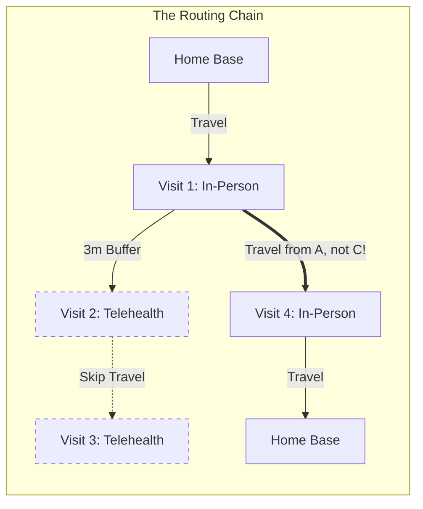
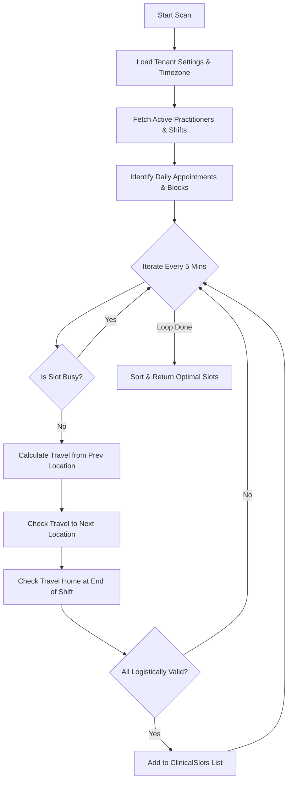
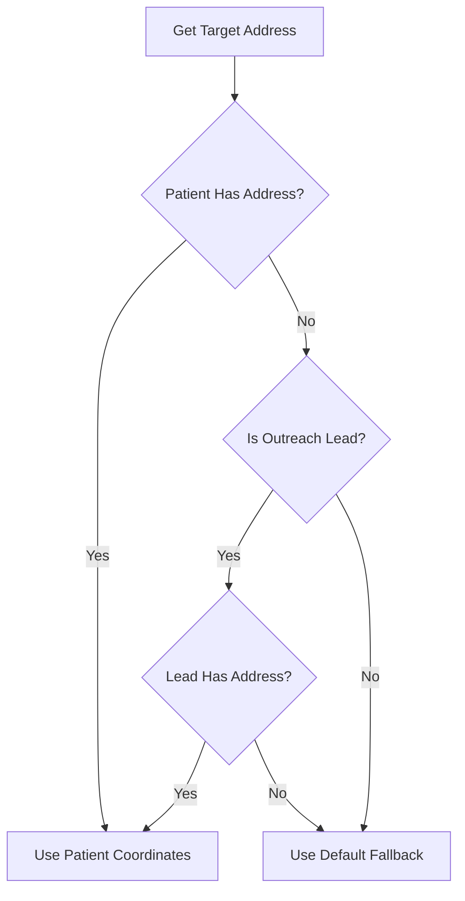

# 🛰️ Scheduling Service: The Geospatial Radar

The **Scheduling Service** is the logistical engine of the Halkyone Clinical OS. It is a high-performance, geospatial-aware system designed to solve the "Traveling Salesman" problem for clinical practitioners. It ensures that every appointment is not only medically necessary but logistically possible.

---

## 🛠️ Core Mission: Why This Exists

In a mobile healthcare environment, "availability" is more than just an empty slot on a calendar. It is a complex function of:

1. **Time**: Practitioner shifts and existing commitments.
2. **Space**: The physical distance between the previous patient, the current patient, and the next.
3. **Modality**: The difference between a physical drive (In-Person) and a digital connection (Telehealth).
4. **Safety**: Ensuring practitioners have enough time to travel safely without rushing (Safety Buffers).

The Scheduling Service handles these variables in real-time, providing a "Geospatial Radar" that scans for valid clinical slots.

---

## 🚀 Key Features

### 1. 🔍 Availability Scanning (`GetAvailableProvidersAsync`)

This is the flagship algorithm. It doesn't just look for gaps; it "simulates" the practitioner's day.

- **Shift Integration**: Respects `ProviderShifts` and `TenantConfigurations` (e.g., AM/PM start hours).
- **Collision Detection**: Filters out `ScheduleBlocks` and existing `Appointments`.
- **Modality-Aware Routing**:
  - If **In-Person**: Calculates travel time from the last known in-person location.
  - If **Telehealth**: Applies a minimal digital buffer (3 mins).

- **Return-to-Base**: Ensures practitioners can drive home within their shift after their last appointment.

### 2. ⚖️ Logistics Validation (`ValidateLogisticsAsync`)

A critical safeguard that prevents "impossible" bookings.

- **Pre-Booking Check**: Validates that a proposed slot allows for sufficient travel time + buffer.
- **Post-Booking Re-Validation**: Used when appointments are moved or reassigned to ensure the surrounding schedule remains intact.
- **Granular Error Reporting**: Returns specific reasons (e.g., _"Logistics Violation: Insufficient time for drive (22m) and buffer (5m) from previous visit."_).

### 3. 🔄 Reassignment Engine (`GetAvailableProvidersForReassignmentAsync`)

Specifically tuned for the "Force Reassign" workflow. It identifies which other practitioners can absorb an existing appointment without breaking their own logistical constraints.

---

## 🧬 Technical Architecture

### **The Geospatial Stack**

- **Distance Calculation**: Powered by `GeoUtils` using coordinates (Latitude/Longitude).
- **Time Estimation**: Converts distance into minutes using estimated travel speeds, adjusted by engine safety settings.
- **Rounding Logic**: All slots are rounded to the nearest 5-minute increment using `GeoUtils.CeilToNearestMinutes` to maintain a clean, readable calendar.

### **Concurrency & Performance**

- **Semaphore Control**: Uses a `SemaphoreSlim(10)` to prevent the server from being overwhelmed by simultaneous geospatial scans during peak booking hours.
- **DB Optimization**: Uses `IDbContextFactory` for thread-safe database operations and `.AsNoTracking()` for high-speed read performance.

### **Data Resiliency**

- **Outreach Support**: Capable of scheduling for "Leads" (not yet patients) by falling back to `PatientOutreach` mailing addresses.
- **Temporal Fallbacks**: Includes hardcoded geographical fallbacks for testing environments where coordinates might be missing.

---

## 🕒 Shift Boundaries & Logistical Timeframes

The engine ensures that the appointment "sandwich" (Travel + Buffer + Duration + Travel Home) fits perfectly within the allocated shift.

```mermaid
gantt
    title Clinical Day Logistics
    dateFormat  HH:mm
    axisFormat  %H:%M
    section Shift
    Shift Boundary (Start) :milestone, 08:00, 0m
    Shift Boundary (End)   :milestone, 17:00, 0m
    section Appointment
    Travel to Patient      :a1, 08:30, 20m
    Safety Buffer          :a2, after a1, 5m
    Clinical Encounter     :a3, after a2, 45m
    Travel Home            :a4, after a3, 25m
```

---

## 🔬 Technical Deep Dive: The Scheduling Algorithm

The core of the service is a **sliding-window simulation** that treats time and space as a single logistical unit.

### 1. The "Appointment Sandwich"

For every potential slot, the engine validates a four-part "sandwich" of time:

1.  **Lead-in Travel**: Estimated travel time from the previous location (or home base) to the patient.
2.  **Safety Buffer**: A mandatory buffer (5m for In-Person, 3m for Telehealth) to account for parking, patient intake, or technical setup.
3.  **Clinical Encounter**: The actual duration of the medical visit.
4.  **Lead-out/Return Travel**: Validates that the practitioner can reach their _next_ commitment or return to their home base within their shift hours.

### 2. Time-Grid Scanning

The engine doesn't just check for "gaps." It performs a **high-resolution scan** in 5-minute increments:

- It iterates from the target start time until the end of the shift.
- For each increment, it runs the full "Sandwich Validation."
- It utilizes `GeoUtils.CeilToNearestMinutes` to ensure that suggested start times are clean and user-friendly (e.g., 10:00, 10:05).

---

## 📊 The "Geospatial Radar" Logic Flow

---

## ⚙️ Configuration

The engine is tuned via `TenantConfigurations`:

- `AmStartHour` / `PmStartHour`: Define the clinical windows.
- `DayEndHour`: The hard stop for all operations.
- `EngineSafetyDriveMins`: The mandatory buffer added to every in-person trip (Default: 5 mins).
- `Timezone`: All calculations are performed in the tenant's local time (e.g., `Asia/Manila`).

---

## 🧩 Core API Methods

### `GetAvailableProvidersAsync`

The primary "Radar" scan. Returns a collection of `ClinicalSlot` objects, which include:

- **Practitioner Identity**: Who is available.
- **Timing**: Precise start/end times.
- **Logistics**: Calculated distance (miles) and travel time (minutes) for that specific trip.

### `ValidateLogisticsAsync`

A post-booking or pre-save validator used to ensure that manual changes don't violate logistical safety. It checks:

- **Previous Proximity**: Can the clinician get there from their last stop?
- **Next Proximity**: Does this new appointment break the _next_ one?
- **Shift Compliance**: Does this fit in the 8-hour workday?

### `RecalculateAppointmentStatsAsync`

A utility method that re-syncs an appointment's distance and travel time metadata if locations or times are adjusted.

---

## 👨‍💻 Developer Notes

When debugging the Scheduling Service, look for logs starting with `>>> GEOSPATIAL RADAR`. These logs provide a detailed trace of the scanning process, including coordinate fallbacks and travel time estimations.

### Concurrency Handling

Because geospatial scans are computationally expensive, the service uses a `SemaphoreSlim(10)`. This ensures that even during peak morning scheduling bursts, the server maintains stable CPU and memory profiles.

---

## 🏗️ Advanced Logistical Features

The scheduling engine implements several specialized patterns to handle real-world clinical mobility:

### 1. Geospatial Chain Scheduling

The system simultaneously validates:

- **Travel from previous location**: `prev.ScheduledEnd + buffer + driveTime`.
- **Travel to next appointment**: Ensures the current slot maintains logistical feasibility for subsequent visits.
- **Shift End (Return Home)**: Validates that the practitioner can return to their home base within their active shift hours.

### 2. Modality-Aware Origin Resolution

The engine tracks the **last physical location**. If a clinician has a Telehealth visit, the system correctly identifies the origin for the next trip as the _previous physical_ location or the home base, preventing "teleportation" logic bugs.

### 3. Triple Fallback Address Resolution

To ensure scheduling continuity even with incomplete data:

1.  **Patient Profile**: Primary clinical address.
2.  **Outreach Lead**: Mailing address fallback for non-enrolled patients.
3.  **Regional Fallback**: Default coordinates for testing and environment bootstrapping.

### 4. Concurrency Control

A `SemaphoreSlim(10)` is utilized to throttle simultaneous geospatial scans, protecting system resources during high-concurrency booking windows.

---

## 🛡️ Supported Scenarios & Edge Cases

- [x] **Telehealth-to-In-Person Transitions**: Travel is anchored to the last physical location.
- [x] **In-Person-to-Telehealth Transitions**: Only digital buffers are applied.
- [x] **End-of-Shift Travel Home**: Logic includes return-to-base travel time within shift boundaries.
- [x] **Geodata Degradation**: Graceful fallback to lead data or regional coordinates.
- [x] **Multi-Timezone Operations**: All calculations use `DateTimeOffset` to ensure consistency across server and local staff timezones.
